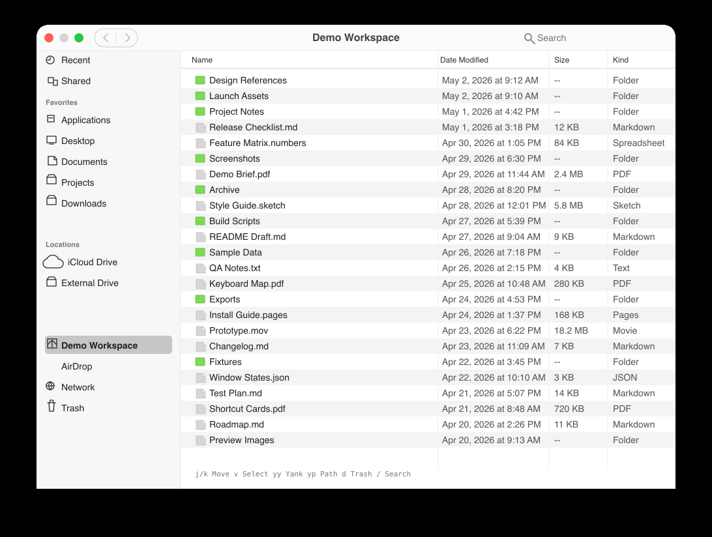

# Clinder

Clinder is a minimal Finder-like macOS popup for fullscreen workflows.

Finder itself cannot float above a native fullscreen Space. Clinder uses an AppKit floating panel with fullscreen auxiliary Space behavior so it can act as a lightweight file browser overlay.

Requires macOS 27 or newer.

## Features

- Finder-style sidebar mirrored from Finder's sidebar lists
- list view for the selected folder
- search within the current folder
- centered folder title with back and forward navigation
- resizable sidebar
- keyboard-first file actions
- Vim-style movement and actions: `j`, `k`, `h`, `l`, `v`, `yy`, `yp`, `d`, `p`
- Enter or double-click to open files/folders
- Command-C, Command-X, and Command-V for native file copy, cut, and paste
- Command-[ and Command-] for back and forward
- Escape to close
