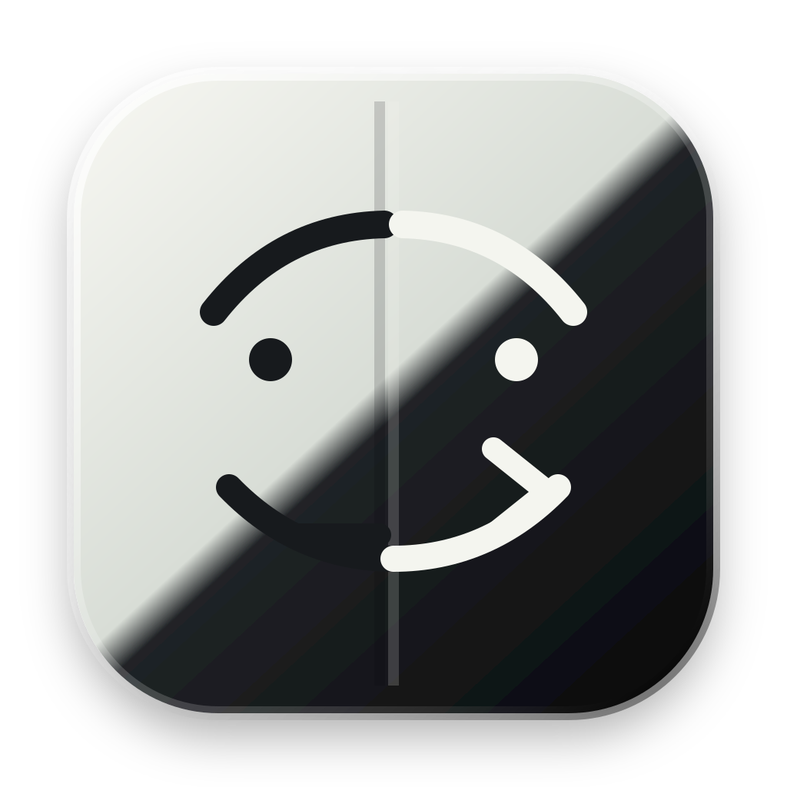

# Clinder



Clinder is a minimal Finder-like macOS popup for fullscreen workflows.

Finder itself cannot float above a native fullscreen Space. Clinder uses an AppKit floating panel with fullscreen auxiliary Space behavior so it can act as a lightweight file browser overlay.

## Icon

The Clinder icon is an inverse Finder face: a light/dark split instead of Finder's blue split, with a small terminal-style prompt mark to reflect the keyboard-first file workflow.

The source lives at `Assets/AppIcon.svg`; the generated bundle icon is `Assets/AppIcon.icns`.

To regenerate it:

```sh
./script/generate_icon.sh
```

## Features

- Finder-style sidebar mirrored from Finder's sidebar lists
- list view for the selected folder
- search within the current folder
- centered folder title with back and forward navigation
- resizable sidebar
- keyboard-first file actions
- Vim-style movement and actions: `j`, `k`, `h`, `l`, `v`, `yy`, `yp`, `d`, `p`
- Enter or double-click to open files/folders
- Command-C, Command-X, and Command-V for native file copy, cut, and paste
- Command-[ and Command-] for back and forward
- Escape to close

## Run

```sh
./script/build_and_run.sh
```

To build, copy the app to `/Applications`, and launch the installed app:

```sh
make run
```

To create a GitHub release and upload the signed macOS app archive:

```sh
make release VERSION=0.0.1
```

For a launch check:

```sh
./script/build_and_run.sh --verify
```

## Local Signing

make run loads local signing settings from .env when the file exists. The file is ignored by git because it contains machine-specific Apple Developer information.

Example:

```sh
CLINDER_CODE_SIGN_IDENTITY="Developer ID Application: Your Name (TEAMID1234)"
CLINDER_DEVELOPER_NAME="Your Name"
CLINDER_SITE_ID="TEAMID1234"
CLINDER_CODE_SIGN_OPTIONS="runtime"
CLINDER_CODE_SIGN_TIMESTAMP="none"
```

When CLINDER_CODE_SIGN_IDENTITY is set, the build script signs dist/Clinder.app, verifies it, checks the developer name and site ID when provided, then copies the signed app to /Applications.
